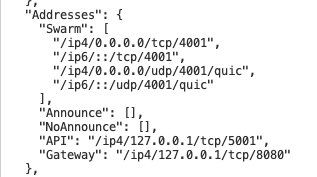
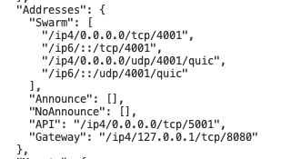

<p align="middle">
    
</p>
<h3 align="middle"><code>@rsksmart/ipfs-cpinner-service</code></h3>
<p align="middle">
    RIF Identity - IPFS Centralized Pinner Service
</p>
<p align="middle">
  <a href="https://rsksmart.github.io/rif-identity-docs/data-vault/cpinner/cpinner-service">
    
  </a>
</p>

A Centralized Data Vault service compatible with RIF Data Vault standard interface. It stores content in an IPFS node associated to a given DID and key.

Alpha version at: []()

## Features

- API for storing, updating and deleting, accessible only proving DID control - uses [DID Auth](https://rsksmart.github.io/rif-identity-docs/ssi/libraries/express-did-auth)
- Open API for retrieving data - **It is strongly recommend to encrypt the content saved in IPFS using this package.**

It is an API designed using IPFS Centralized Pinner Provider

## Usage

The IPFS Centralized pinner service is designed to let users store files for free. This files are pinned into IPFS.

Content is stored in `did -> key -> file[]` dictionary. Files with a same `key` can be accessed all together.

This service implements the [DID Auth protocol](https://rsksmart.github.io/rif-identity-docs/ssi/specs/did-auth) to protect the API.

### API

The API is divided in two. Content modifications need [authenticated requests using DID Auth](https://github.com/rsksmart/rif-identity.js/tree/develop/packages/express-did-auth) and is supposed that the content uploaded is encrypted. This enables the accessing API to be open to anybody.

### Uploading content

Add files given a file `key`

```
POST /content/:key { body: content } -> { id }
```

Update files of a given `key`

```
PUT /content/:key/ { content } -> { id }
```

Update a specific file of a given `key`

```
PUT /content/:key/:id { content } -> { id }
```

Delete all files of a given `key`

```
DELETE /content/:key -> { }
```

Delete a specific file of a given `key`

```
DELETE /content/:key/:id -> { }
```

### Accessing content

Get all keys of a given `did` (needs authentication)

```
GET /keys/:did -> { keys: string[] }
```

Get all files of a given `did` and `key`

```
GET /content/:did/:key -> [{ id: string, content: string }] (get files)
```

## Advanced usage

See our [documentation](https://rsksmart.github.io/rif-identity-docs/data-vault/cpinner/cpinner-service)

## Run for development

The service will:
- Setup a local database were content associated to DIDs is mapped
- Start IPFS client against a local node to put and pin files
- Start Express app with DID Auth asd explained above

### Configure

Create an `.env` file in the root of the project with the following:

```
DATA_VAULT_PORT=port where the service will be served
LOG_FILE=relative path of the log file
LOG_ERROR_FILE=relative path of the error log file
PRIVATE_KEY=private key associated to the service. Is used to sign access tokens
SERVICE_URL=will be used as the `aud` file for JWTs. It expects this value to be present in the challenge response sent by the client and is part of the acces token emitted by the service
DB_FILE=relative path of the sqlite database
RPC_URL=rsk rpc url
NETWORK_NAME=rsk:testnet or rsk
IPFS_PORT= port of an http IPFS node api
IPFS_HOST=host of an IPFS node api
CHALLENGE_SECRET=secret used to create deterministic challenges
```

Default values:

```
DATA_VAULT_PORT=5107
LOG_FILE=./log/new-data-vault.log
LOG_ERROR_FILE=./log/new-data-vault.error.log
DB_FILE=./db/new-data-vault.sqlite
NETWORK_NAME=rsk:testnet
IPFS_HOST=localhost
IPFS_PORT=5001
```

Example:

```
DATA_VAULT_PORT=5107
LOG_FILE=./log/data-vault.log
LOG_ERROR_FILE=./log/data-vault.error.log
PRIVATE_KEY=139d64ebceeb8b7702104a13d1d041303bd4a2f42090fa8c0b11c89cb97a5b24
SERVICE_URL=http://datavault.com
DB_FILE=./db/data-vault.sqlite
RPC_URL=https://did.testnet.rsk.co:4444
NETWORK_NAME=rsk:testnet
IPFS_HOST=localhost
IPFS_PORT=5001
CHALLENGE_SECRET=aSecret
```

### Set up IPFS

First of all you need to have access to an IPFS node API. To run it locally:

1. Install IPFS CLI. Find your option: https://docs.ipfs.io/how-to/command-line-quick-start/.

2. Init IPFS (once)

  ```
  ipfs init
  ```

3. Start IPFS Daemon

  ```
  ipfs daemon
  ```

  This will expose the IPFS API in `http://localhost:5001`

### Run locally

From the root of the project:

```
npm i
npm run start
```

### Run with Docker

It will create two containers: one for the service and another one with the IPFS node. Both containers will be in the same network.

Make sure that in your `.env` file you have set the IPFS references as the following:
```
IPFS_HOST=rif-identity-data-vault-ipfs
IPFS_PORT=5002
```

1. From the root of the project:

```
docker-compose build
docker-compose up -d
```

2. Enable access to IPFS node container port 5002

    ```
    docker container ls
    # copy the id of the container named rif-identity-data-vault-ipfs:latest
    docker exec -it COPIED-ID bash # e.g. 967eb3ce4730
    cd /root/.ipfs/
    apt update
    apt install vim
    vim config
    ```

    Update `“Addresses” -> “API”` and open ip4 port. Set `“API”: “/ipv4/0.0.0.0/tcp/5001"`

    Before the update
    
    

    After the update

    

    Save the file and exit the container

    ```
    exit
    ```

    Now restart IPFS docker

    ```
    docker restart COPIED-ID
    ```

3. Perform a quick health check: submit a GET request to: `http://localhost:5107/request-auth/myDid` and it should respond an HTTP 200 with a `challenge`

## Test

From base repo directory run `npm test` or any of the described [test script variants](../../README#test).
